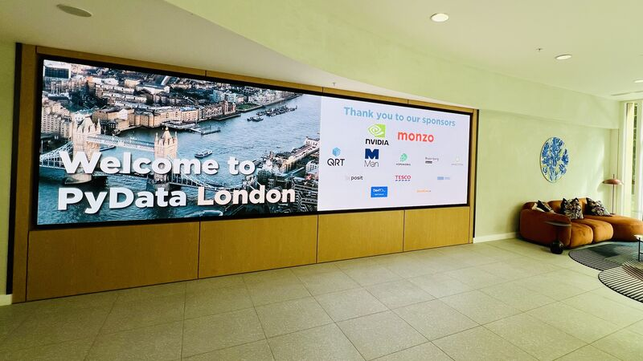

## PyData London 2025 - Day1 

#### 🚀 Tutorial Day at PyData London 2025!

Kicked off the conference with an amazing day of tutorials. Here’s what I dove into:

##### 🧠 [GPU Accelerated Python](https://cfp.pydata.org/london2025/talk/HFWMHG/) — by Jacob Tomlinson , Lawrence Mitchell , Jeremy Tanner and Katrina Riehl from NVIDIA 

###### What I learned:
 • How GPUs work (in a nutshell) ⚙️
 • Writing Python code for GPUs with Numba 🐍⚡
 • The ecosystem of GPU-accelerated Python tools like RAPIDS

##### 🤖 [Transformers Inside Out](https://cfp.pydata.org/london2025/talk/R3UJN7/) — by Sam Joseph 

###### Key takeaways:
 • A refresher on Transformer architecture 🧱
 • Building a mini-GPT model from scratch using nanoGPT 🔧
 • And yes… how to write good knock-knock jokes with AI 😄🪄

##### 🕸️ [Graph Theory for Multi-Agent Integration: Clinical Use Cases](https://cfp.pydata.org/london2025/talk/PRDCGC/) — by Ahmad Albarqawi 

###### Highlights:
 • Using graph-based architectures to orchestrate AI workflows 🧩
 • Introducing IntelliNode, an open-source library 🧠💡
 • Seeing MCP in action in real-world practice

All three sessions were incredibly insightful — I’ve already filled pages with notes and things to explore further! 📚📝

But learning must momentarily pause… because the next two days are packed with amazing talks! Can’t wait! 🙌🎤