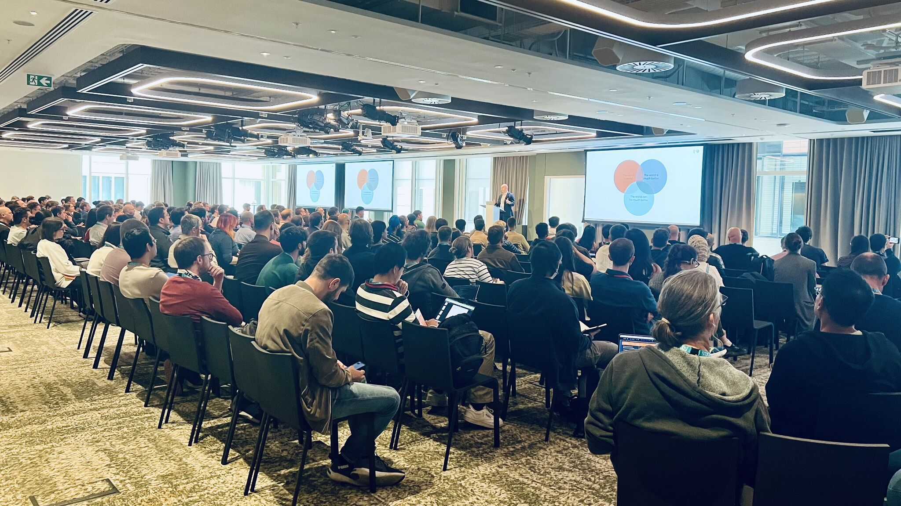

## PyData London 2025 - Day3

We kicked off bright and early with **⚡️lightning talks**! There were so many excellent submissions that 👨‍💻 Emlyn Clay had to spin the lucky wheel to decide who got to present. Every talk was packed with insights—and lots of fun!

Later, I had the chance to help host some incredible sessions:

🎯 **Automating Porosity Detection in Additive Manufacturing with Deep Learning** by Onyekachukwu Faith Ojumah. 

It’s always exciting to see convolutional neural networks being applied to real-world challenges like detecting defects in manufacturing.

🧙‍♂️**One repo to rule them all, one repo to bind them...Control all of your projects with copier!**, by Tim Paine

copier (https://lnkd.in/g5T3nU5N) is a fantastic tool—a library and CLI app that helps render and manage project templates effortlessly.

🤖 **Git Commit, MedTech Transformed: Python’s Medical Robotics Breakthrough**, by Lilinoe Harbottle

A powerful session on using 3D CNNs for lung cancer diagnosis and robotic-assisted treatments. Truly inspiring work at the intersection of Python and healthcare.

🍽️We then had a PyData leader lunch. It was amazing to connect with fellow organisers from across the globe, swap ideas, and discuss how to build a stronger, more connected community.

🍀Then I was so lucky to receive a signed copy of Jeroen Janssens and Thijs Nieuwdorp 's new book - **Python Polars: The Definitive Guide**! 

🎤 The **keynote by Tony Mears focused on innovation—thought-provoking and energising**.

The afternoon tech track was just as exciting. Here’s what I caught:

🧠 **Debugging Leadership: Six Errors when Moving From Code to Management**, by Matthew Upson 📈

Packed with practical advice on navigating the tricky path from engineering to leadership.

You Came to a Python Conference. Now, Go Do a PR Review! by Samiul Huque

A must-see session on what makes (and breaks) a good PR review, especially in Python projects.

🐳 **Polars, DuckDB, PySpark, PyArrow, pandas, cuDF: how Narwhals has brought them all together!** by Marco Gorelli

Narwhals (https://lnkd.in/gjVMnX9A) provides a lightweight, extensible compatibility layer for working across dataframe libraries. Super useful for tool developers.

😋We wrapped up the day with a warm and joyful volunteers/organisers dinner. I'm so grateful to be part of this amazing community.❤️ Huge thanks to everyone who made this all possible—you’re what makes PyData feel like home! 

That’s a wrap for PyData London 2025—and I already can’t wait for next year! 

If you’re feeling the same, don’t worry—PyData Berlin, PyData Amsterdam, and PyData Paris are just around the corner. Check them out here: https://lnkd.in/gSVxPy7x

And don’t forget, we host monthly meetups right here in London!
Join us: https://lnkd.in/g-tG7CxG 
Submit your talk: https://lnkd.in/gHvqAhnc